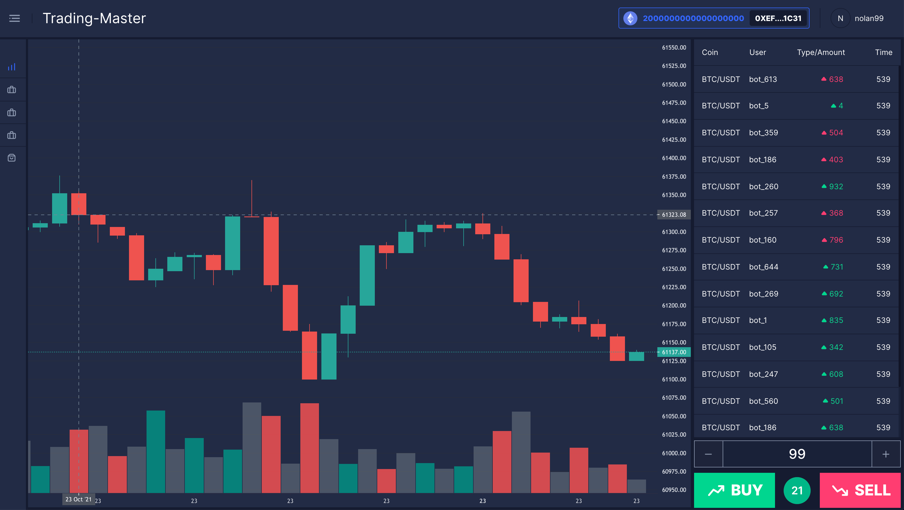
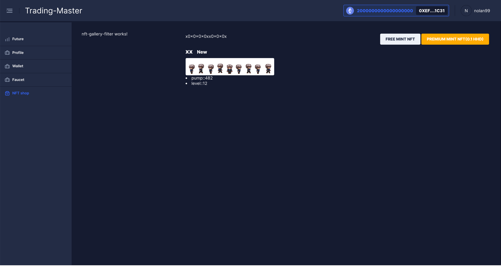
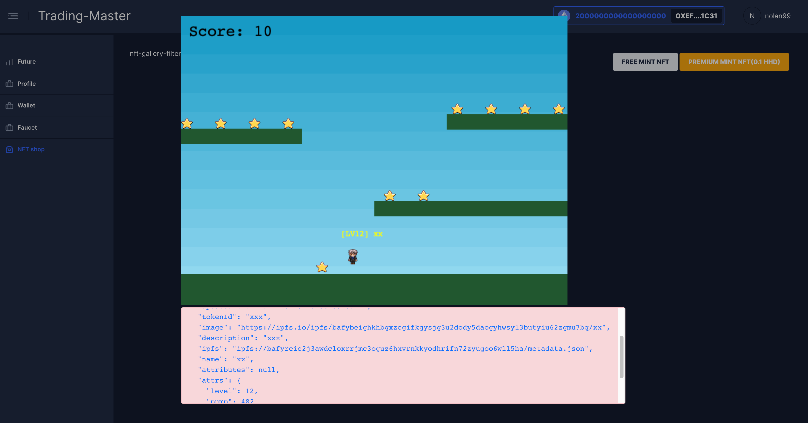
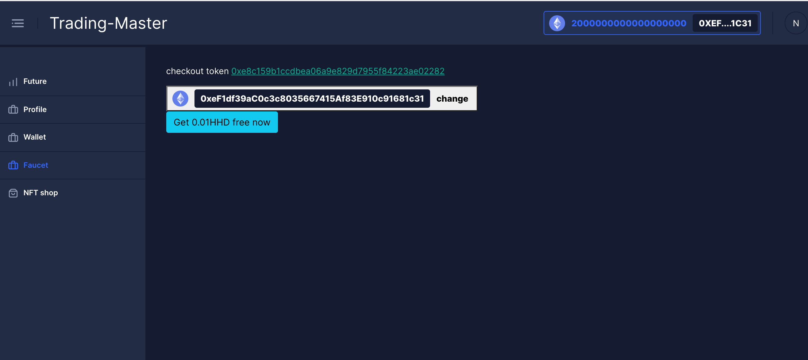
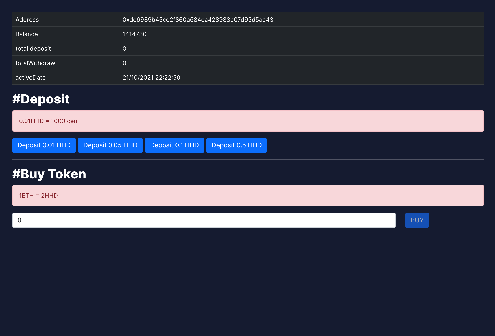

# A example about binary option trading and smart contract ERC20, ERC721

> If you start project and register a account, pls fill OTP is 1111
> Because this one is an example project which i learn and practice about Angular and Smart contract. how does it work!. and I don't have many times for it. so maybe there are many bugs in project about frontend and backend also. but when I have time i will refactor it again.
> Thanks for your understanding. Stay tuned!

## Working Game

There is no live demo version

The game is binary option trading



## Feature

Mint token NFT such as sprite character in a game



We can preview a charater by click to the charater



The faucet feature can give you some token, if you want to deposit with free



Deposit and buy token feature



> Please text to me if u have any problems

## Credits and references

| Resource                                      | Description                                                                                                                       |
| --------------------------------------------- | --------------------------------------------------------------------------------------------------------------------------------- |
| [Truffle]                                     | Is a development environment, testing framework and asset pipeline for Ethereum                                                   |
| [ethers]                          | Is a library which interact smart contract as well                              |
| [Nestjs] | Is a framework for backend |
| [Angular]                 | Is a framework for frontend                          |
| [https://infura.io/][service]                 | it provides the tools and infrastructure that allow developers to easily take their blockchain application                          |
| [https://nft.storage/][service]                 | it provides decentralized storage on IPFS and Filecoin                         |
| [Ganache]                 | Is a tool for creating a local blockchain for fast Ethereum development.                         |
| [Socket.io,...]                 | Others lib                        |

```
- OpenZeppelin Contract v4
https://docs.openzeppelin.com/contracts/4.x/

- ERC721 Tutorial, Simple tutorial for a customizable marketplace for buying and selling on OpenSea
https://docs.opensea.io/docs/1-structuring-your-smart-contract

- NFT Minter Tutorial
https://docs.alchemy.com/alchemy/tutorials/nft-minter

- Free Storage for NFTs, Free decentralized storage and bandwidth for NFTs on IPFS logo IPFS and Filecoin logo Filecoin.
https://nft.storage/

- Awesome Blockchains
https://github.com/openblockchains/awesome-blockchains

- Solidity Patterns
https://github.com/fravoll/solidity-patterns

- This document provides a baseline knowledge of security considerations for intermediate Solidity programmers. It is maintained by ConsenSys Diligence, with contributions from our friends in the broader Ethereum community.
https://github.com/ConsenSys/smart-contract-best-practices/blob/master/README-vi.md

- Smart Contract Security Best Practices
https://consensys.github.io/smart-contract-best-practices/
```